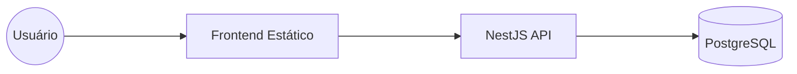

<div align="center">
  
  <h1>Stuchi Editora</h1>
  <p><strong>Transformando Autores e Histórias</strong></p>
  <p>Plataforma editorial híbrida integrada: Frontend institucional e API NestJS para gestão de originais.</p>
</div>

---

## 📚 O Projeto

A **Stuchi Editora** é um projeto de site institucional desenvolvido para apresentar uma editora e organizar o processo de envio de originais por novos autores. Este repositório reúne o frontend institucional e a API utilizada para gerenciar envios de manuscritos e conteúdo do site.

### Diferenciais da Implementação
- **Performance:** Frontend em HTML/JS puro para carregamento instantâneo e SEO otimizado.
- **Escalabilidade:** Backend em NestJS organizado em módulos para facilitar manutenção e futuras expansões.
- **Internacionalização:** Suporte estruturado para PT-BR, EN e ES, visando a expansão Stuchi Europa.

## 🏗️ Arquitetura do Sistema

O projeto utiliza uma arquitetura desacoplada para garantir velocidade no cliente e segurança no processamento de dados.

- **Frontend:** Vanilla HTML5, CSS3 e JavaScript. Sem etapas de build complexas.
- **Backend:** Node.js, NestJS, TypeScript e Prisma ORM.
- **Banco de Dados:** PostgreSQL (Gestão de livros, imprensa e submissões).



## 📂 Estrutura de Pastas

```text
.
├── assets/          # Estilos globais, assets de marca e scripts client-side
├── backend/         # Núcleo da API (Módulos NestJS e Schema Prisma)
├── en/, es/         # Arquivos estáticos para suporte multilíngue
├── *.html           # Páginas principais (Home, Publique Conosco, etc.)
└── .gitignore       # Regras de versionamento
```

## 🛠️ Desenvolvimento Local

Para rodar o ecossistema completo em sua máquina:

### 1. Backend (API)
A API gerencia a lógica de negócios e submissão de originais.
```bash
cd backend
npm install
cp .env.example .env  # Configure suas credenciais do DB
npx prisma migrate dev
npm run start:dev
```

### 2. Frontend
Como é puramente estático, utilize qualquer servidor local de sua preferência:
```bash
# Exemplo com 'serve'
npx serve .

# Exemplo com Python
python -m http.server 8000
```

---

## ✉️ Contato & Presença
- **Email:** [Contatos@stuchieditora.com](mailto:Contatos@stuchieditora.com)
- **WhatsApp:** [Entre em contato](https://wa.me/5511969569809)
- **Instagram:** [@stuchi_editora](https://www.instagram.com/stuchi_editora/)

**Site Oficial:** [stuchieditora.com](https://gabriel-g-dev.github.io/stuchi-editora/)

Projeto desenvolvido por Gabriel Garcia como parte de estudos e projetos em desenvolvimento web.
