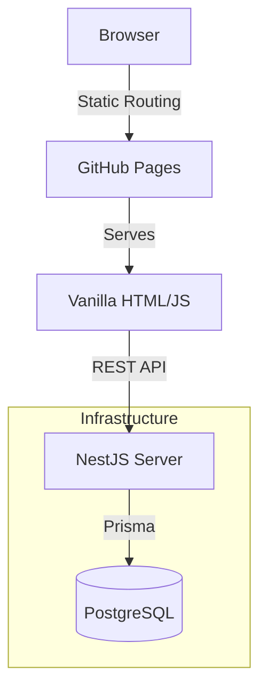

<div align="center">
  
  <h1>Stuchi Editora</h1>
  <p>Static Frontend and NestJS API for a literary publishing platform.</p>
</div>

---

## Overview

Stuchi Editora is a hybrid platform handling institutional content and author manuscript submissions. It uses a decoupled architecture to maintain a fast, static frontend while properly securing backend operations.

The client-side is purely static (HTML/CSS/JS) to maximize loading speed and SEO ranking, hosted directly from the repository. The backend is a NestJS REST API that handles dynamic data (books, press releases, podcasts) and secure manuscript submissions.

## Architecture

- **Frontend:** Vanilla HTML5, CSS3, and JavaScript. Zero build step.
- **Backend:** Node.js, NestJS, TypeScript, Prisma ORM.
- **Database:** PostgreSQL.



## Structure

```text
/
├── assets/          # Global styles, images, and client-scripting
├── backend/         # NestJS application (source, modules, prisma schema)
├── en/              # English static files
├── es/              # Spanish static files
├── *.html           # Portuguese static files (Root)
└── .gitignore       # Global ignore rules
```

## Local Development

You need to run the frontend and backend separately.

### Backend Setup

The API runs on `localhost:3000` by default.

```bash
cd backend
npm install

# Setup env vars (use .env.example)
# Add your database URL
cp .env.example .env

# Run database migrations
npx prisma migrate dev

# Start development server
npm run start:dev
```

### Frontend Setup

Serve the root directory using any local static server.

```bash
# Using 'serve'
npx serve .

# Or using python
python -m http.server 8000
```

*Developed by [Gabriel-hub-prog22](https://github.com/Gabriel-hub-prog22).*
